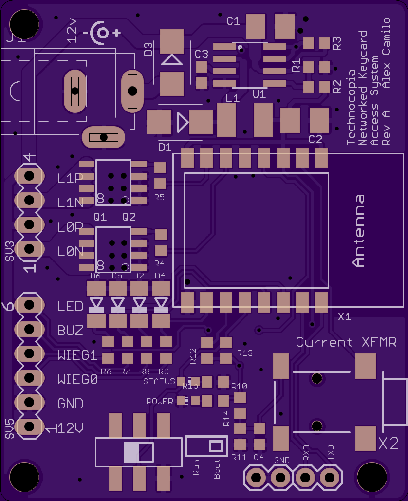

# Tek-ESP8266-RFID-Access-Control

## Requirements ##
* Accept [Wiegand](https://en.wikipedia.org/wiki/Wiegand_interface) data from a rfid reader
* Power everything off of a 12v wall wart.
* Query a database over WiFi with card data.
* Controll Relays, Lights, Door latches

